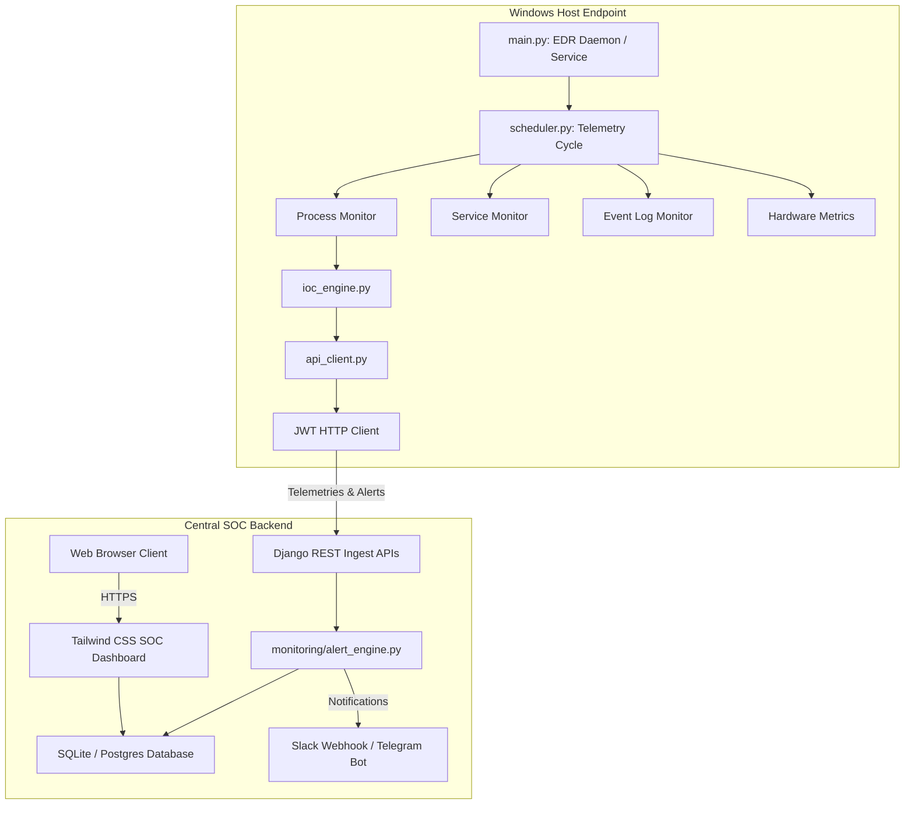

# Sentinel EDR - Windows Service & Process Monitoring Agent

Sentinel EDR is a lightweight, production-ready Endpoint Detection & Response (EDR) agent and centralized Django security operations center (SOC) dashboard. It monitors Windows processes, services, event logs, registry modifications, system resource utilization, and compares actions against active threat Indicators of Compromise (IOC) rule definitions to generate real-time alerts.

---

## 🏛️ System Architecture Diagram



---

## 📁 Project Directory Structure

```text
Windows-Service-Process-Monitoring-Agent/
│
├── agent/                      # Windows Monitoring Agent (Python)
│   ├── modules/                # Telemetry collector components
│   │   ├── cpu_monitor.py      # CPU load and top consumer tasks
│   │   ├── disk_monitor.py     # Partition storage & I/O
│   │   ├── eventlog_monitor.py # Windows EvtQuery XML parser (Security/Sysmon)
│   │   ├── ioc_engine.py       # Compare system objects with active threat rules
│   │   ├── memory_monitor.py   # RAM load and processes
│   │   ├── network_monitor.py  # Outbound upload/download & established connections
│   │   ├── process_monitor.py  # Snapshot diff engine (New/Terminated process events)
│   │   └── service_monitor.py  # pywin32 Windows Service query tool
│   ├── agent.spec              # PyInstaller executable compilation spec
│   ├── api_client.py           # JWT auth and HTTP transmission engine
│   ├── config.json             # Agent local options and intervals
│   ├── logger.py               # Rotating JSON format log writer
│   ├── scheduler.py            # Callback loop scheduler
│   ├── utils.py                # Hashing (SHA256) and host context tools
│   └── main.py                 # Windows Service Framework entry point
│
├── backend/                    # Centralized Django Management Dashboard
│   ├── core/                   # Main Django configuration urls & settings
│   ├── monitoring/             # Primary backend applications
│   │   ├── migrations/         # Auto-generated SQLite schemas
│   │   ├── alert_engine.py     # Real-time process telemetry evaluations
│   │   ├── models.py           # Process, Service, Alerts, SystemHealth, IOC rules
│   │   ├── report_generator.py # ReportLab PDF / CSV report compilers
│   │   ├── serializers.py      # DRF request formats validations
│   │   ├── tests.py            # Django API integration tests
│   │   └── views.py            # AJAX endpoints and core view controllers
│   └── manage.py               # Django utility CLI entry point
│
├── static/                     # Shared static assets (CSS/JS)
├── templates/                  # Dark theme HTML templates matching Midnight Protocol
├── tests/                      # Local testing scripts
│   └── agent_tests.py          # Agent unittest specifications
├── Dockerfile                  # Django backend container builder
├── docker-compose.yml          # Django + Postgres multi-container setup
├── build.bat                   # PyInstaller agent build batch script
├── seed_db.py                  # Seeder script to initialize default users & IOC rules
├── requirements.txt            # Project python dependencies file
├── LICENSE                     # Software License
└── README.md                   # This README documentation
```

---

## ⚡ Quick Start & Installation

### Prerequisites
* Python 3.13+ installed.
* Windows administrative privileges (needed to query Sysmon and Security event logs).

### 1. Database Setup & Server Boot
Clone the project, install requirements, and seed user accounts:
```bash
# Install dependencies
pip install -r requirements.txt

# Run migrations
python backend/manage.py makemigrations monitoring
python backend/manage.py migrate

# Seed database with Default Users and IOC rules
python seed_db.py

# Boot Development Server
python backend/manage.py runserver
```
Navigate to `http://127.0.0.1:5000` and authenticate with:
* **Admin User:** `admin` / `admin_password_123`
* **SOC Analyst User:** `analyst` / `analyst_password_123`
* **Viewer User:** `viewer` / `viewer_password_123`

### 2. running the Windows Agent
To run the agent locally in foreground console mode:
```bash
python agent/main.py --console
```
To register the agent as a native background Windows Service:
```bash
# Install the service
python agent/main.py install

# Start the service
python agent/main.py start
```

### 3. Packaging the Agent Executable
To bundle the agent as a single `.exe` file without python dependencies:
```cmd
build.bat
```
The compiled binary will be generated under `agent/dist/sentinel_agent.exe`.

---

## 📡 Ingestion API Documentation

All ingestion endpoints require JWT authentication. Ship payloads using a `Authorization: Bearer <Token>` header.

### 1. JWT Authentication Pair
* **Endpoint:** `POST /api/token/`
* **Request Format:**
```json
{
  "username": "agent_user",
  "password": "agent_password_123"
}
```
* **Response Format:**
```json
{
  "refresh": "eyJhbGciOi...",
  "access": "eyJhbGciOi..."
}
```

### 2. Process Telemetry Ingestion
* **Endpoint:** `POST /api/telemetry/processes/`
* **Request Format:**
```json
{
  "processes": [
    {
      "pid": 4124,
      "ppid": 1004,
      "name": "cmd.exe",
      "username": "DESKTOP-ABC\\SYSTEM",
      "exe": "C:\\Windows\\System32\\cmd.exe",
      "cmdline": "cmd.exe /c whoami",
      "cpu_percent": 0.1,
      "memory_percent": 0.5,
      "sha256": "848adfa890e...",
      "is_suspicious": true,
      "suspicious_reason": "Process name matches blacklisted list"
    }
  ]
}
```

### 3. Service Status Ingestion
* **Endpoint:** `POST /api/telemetry/services/`
* **Request Format:**
```json
{
  "services": [
    {
      "name": "WinDefend",
      "display_name": "Windows Defender",
      "status": "Running",
      "start_type": "Automatic"
    }
  ]
}
```

---

## 🔍 Investigation Cases & Timelines
The **SOC Investigation Page** offers:
1. **Host Event Correlator:** Maps all security events and process launches into a single chronologically sorted timeline.
2. **Process Tree Listing:** Shows parent-child structures (PID vs. PPID) to identify process spoofing or lateral execution paths.
3. **JSON Forensics Export:** Generates complete case reports including investigator notes and all associated alerts.

---

## 🔮 Future Enhancements
* **Machine Learning Process Profiling:** Implementing behavioral analysis to detect anomalies beyond static IOC matching.
* **Agent Remote Command shell (Response Action):** Adding capability to remotely isolate endpoints, kill PIDs, or retrieve memory dumps directly from the SOC dashboard.
* **ETW (Event Tracing for Windows) Integration:** Direct ETW hook monitoring to capture kernel-level file modifications and network connections.
